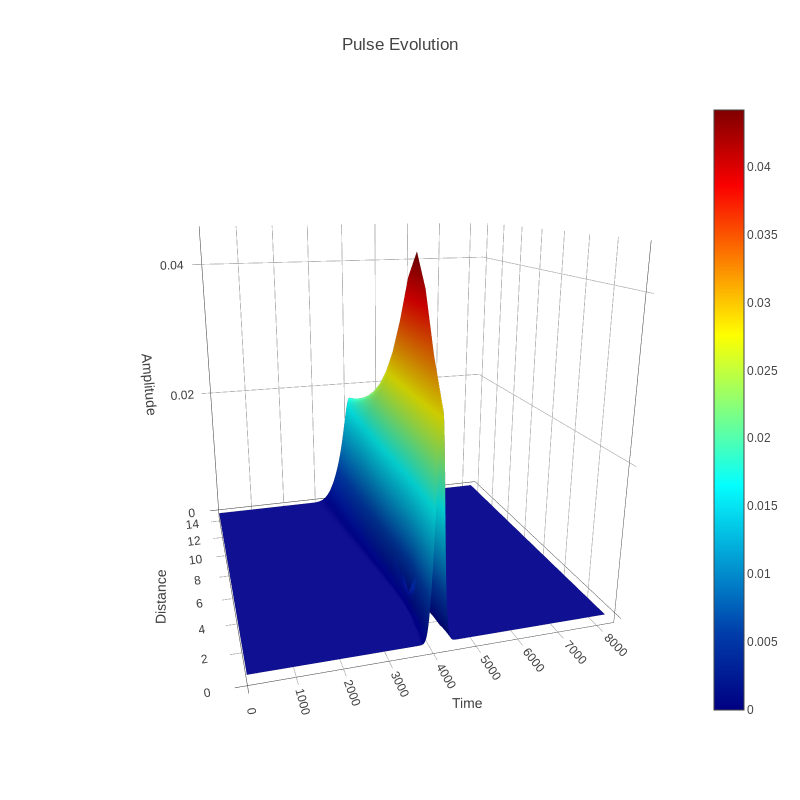

# split-step-fourier-method-python :snake:
A algorithm used for simulate a pulse propagation in fiber optics made with **Python3** :sparkles:


### :package: Dependencies:
- numpy
- scipy
- plotly


### :bookmark: Reference:
The reference code was made in **Matlab** and can be found in:

[split-step-fourier-method-matlab](https://www.mathworks.com/matlabcentral/fileexchange/14915-split-step-fourier-method) made by [Muddassir Iqbal](https://www.mathworks.com/matlabcentral/profile/authors/893543-muddassir-iqbal)

## :chart_with_upwards_trend: Plots
<p align="center">
    
</p>


more coming soon...

## :wrench: Install dependencies
```shell
pip3 install -r requeriments.txt
```


## :rocket: Run
```shell
python3 split-step-fourier-method.py
```

> It will open your browser and show the plots

<br>
<br>

:v: Made by <a href="https://github.com/jeovazero">@jeovazero</a>
